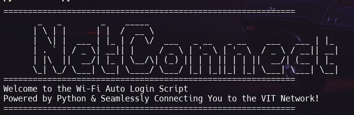

<br>

# NetConnect

**NetConnect** is a fully modular, cross-platform Python automation tool designed to simplify WiFi connectivity — including automatic login through captive portals. Built using OOP principles, NetConnect supports Linux, Windows, and macOS, offering a seamless CLI interface and startup automation.

[](#)
[](#)
[](#)
[](#)
[](#)
[](#)


## 🚀 Features

-  **Auto WiFi Connection**: Automatically connects to known WiFi networks across Linux, Windows, and macOS.
-  **Captive Portal Handling**: Detects and logs into captive portals using saved credentials.
-  **Modular & OOP Structure**: Clean, extendable codebase using object-oriented principles.
-  **Cross-Platform CLI**: Lightweight, interactive CLI interface with OS-specific handling.
-  **Credential Management**: Securely store and manage login credentials for networks.
-  **Startup Automation**: Automatically run NetConnect at system boot.
-  **Config Persistence**: Stores settings and credentials in JSON format for reuse.

## 🛠️ Tech Stack

### Core Technologies

- **Python**: Core language used for automation, system interaction, and modular scripting.
- **OS Modules**: Built-in libraries like `os`, `subprocess`, and `platform` for cross-platform compatibility.
- **JSON**: Used for storing configurations and user credentials persistently.
- **Batch/Shell Scripts**: OS-specific scripting for boot-time automation and system-level control.

### Tools & Environment

- **Visual Studio Code**: Primary code editor with GitHub Copilot integration.
- **Git**: Version control and collaboration.
- **Windows, Linux, macOS**: Full support across major operating systems.

## ❓ Why NetConnect?

Connecting to campus WiFi — especially one with captive portals — can be a repetitive and frustrating task for students. **NetConnect** was born out of the need to simplify this experience for the students of **VIT**, by providing a cross-platform automation tool that:

- Removes the hassle of manually logging in every time.
- Works seamlessly across **Windows**, **Linux**, and **macOS**.
- Offers a clean, secure, and interactive CLI-based solution.
- Empowers students with a modular and extendable tool that just works.

## 📋 Installation & Working

### Prerequisites
Before running the project, ensure that the following software is installed:

- **Python 3.7+**: Required for running the automation script.

```bash
# Clone the repository
git clone https://github.com/PacemakerX/NetConnect.git

cd NetConnect

python main.py
```

## Link to the Repository:

<p align="center">
<a href="https://github.com/PacemakerX/NetConnect.git">
  
</a>
<p>

## Feel free to connect with me!

<p align="center">
  <a href="mailto:sparsh.officialwork@gmail.com">
    
  </a>
  <a href="https://www.linkedin.com/in/sparshsoni">
    
  </a>
</p>
